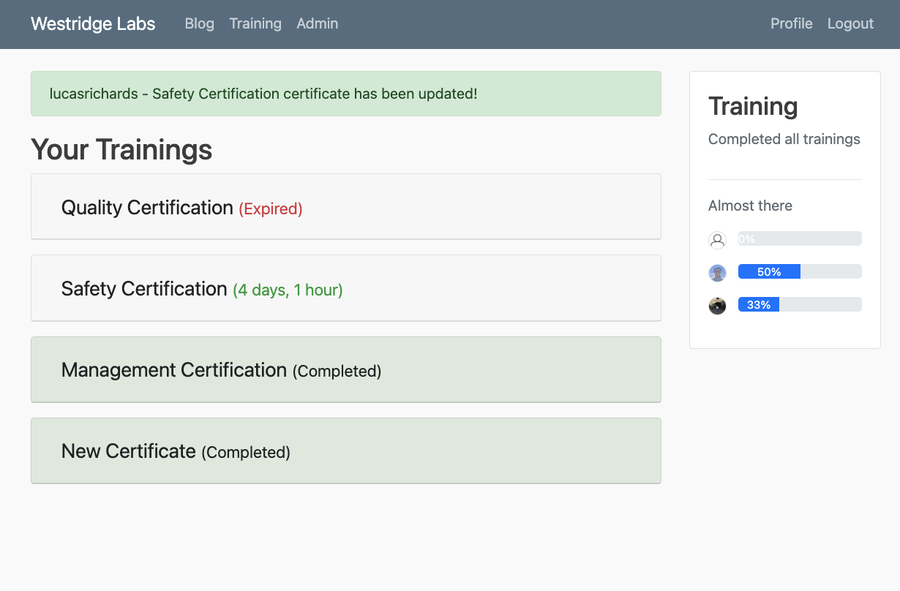
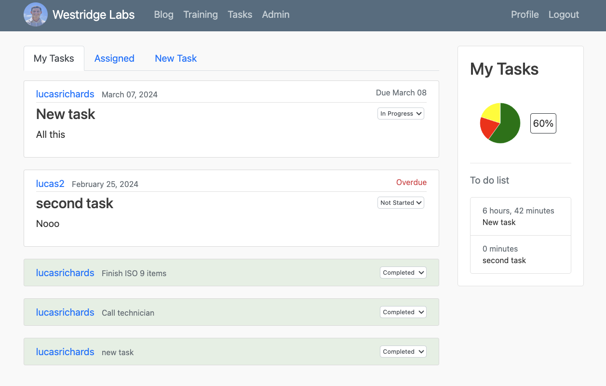
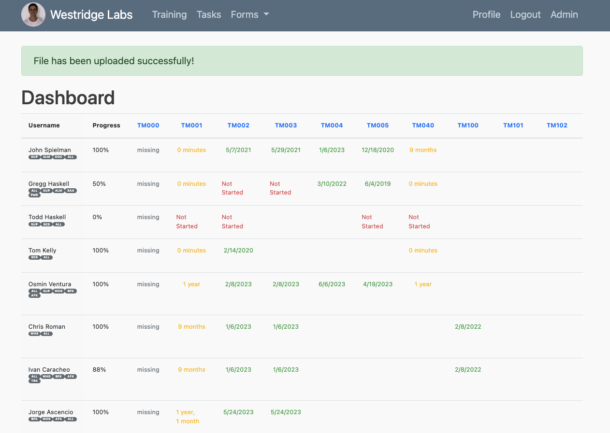
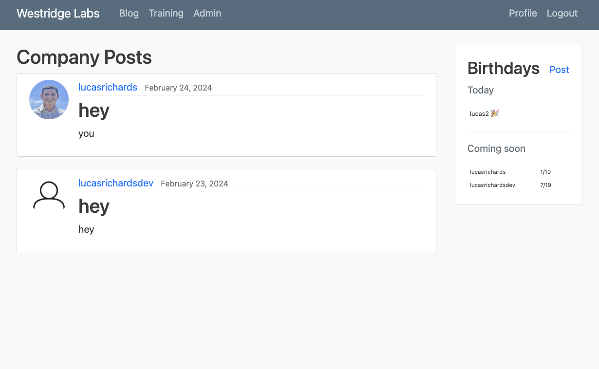
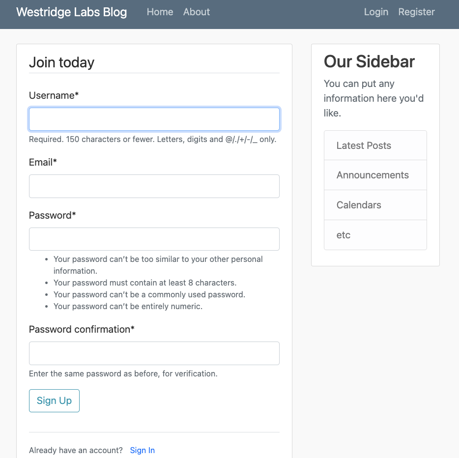
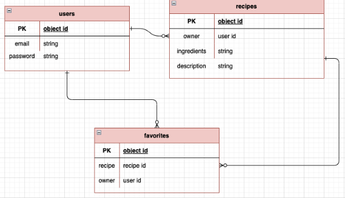

# Westridge Laboratories App

## Overview
This application was created for a small business. Includes:
  - Training Tracker
  - Tasks
  - Reminders
  - Birthday Tracker
  - Company's Blog
  ##### Coming up...
  - File Management System
  - Messaging

## Getting started
##### Recommended to use python virtual environment
run `pipenv shell`
###### install requirements
run `pip install -r requirements.txt`
###### run server
run `python3 manage.py runserver`

## User Stories
A detailed list of the functionality of your application, told through a user's perspective
  - As a user, I want the ability to sign up.
  - As a user, I want the ability to sign in. 
  - As a user, I want the ability to change my password. 
  - As a user, I want the ability to sign out. 
  - As a user, I want the ability to create my own blogs. 
  - As a user, I want the ability to update my posts. 
  - As a user, I want the ability to view all of my posts. 
  - As a user, I want the ability to read more details of others posts. 
  - As a user, I want the ability to delete my posts. 
  - As a user, I want the ability to view posts others have created. 
  - As a user, I want the ability to favorite posts that other people have created. 
  - As a user, I want the ability to read all of the posts I have favorited. 
  - As a user, I want the ability to remove posts from my favorites.

## Wireframes / Screenshots
Diagrams that display what your application will look like, and images from the completed app.

## Entity Relationship Diagrams 
Diagrams that describe the relationships between your resources.

### If use pip to install a module, recreate the requirements.txt file

run `pip freeze > requirements.txt` to generate a new requirements file

## Deployment

follow https://docs.render.com/deploy-django#manual-deployment

`python -m pip install gunicorn.`

run command for deployment
`gunicorn mysite.wsgi`

allow new host on settings.py

## Static files

`pip install whitenoise`
`pipenv run pip freeze > requirements.txt`

add middleware
`'whitenoise.middleware.WhiteNoiseMiddleware' `
and
`if not DEBUG:`
    # Tell Django to copy statics to the `staticfiles` directory
    # in your application directory on Render.
    `STATIC_ROOT = os.path.join(BASE_DIR, 'staticfiles')`

    # Turn on WhiteNoise storage backend that takes care of compressing static files
    # and creating unique names for each version so they can safely be cached forever.
    `STATICFILES_STORAGE = 'whitenoise.storage.CompressedManifestStaticFilesStorage'`

# RESTfull API Django Framework

root urls: path('api-auth/', include('rest_framework.urls', namespace='rest_framework')),
settings: REST_FRAMEWORK
settings: installed apps  'rest_framework',
urls 
views
serializer 

