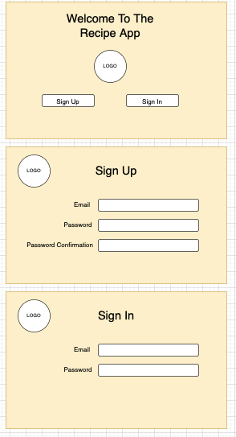

## Blog App for westridge Laboratories

## Overview
a brief description of your application
## User Stories
a detailed list of the functionality of your application, told through a user's perspective
  - As a user, I want the ability to sign up.
  - As a user, I want the ability to sign in. 
  - As a user, I want the ability to change my password. 
  - As a user, I want the ability to sign out. 
  - As a user, I want the ability to create my own recipes. 
  - As a user, I want the ability to update my recipes. 
  - As a user, I want the ability to view all of my recipes in a list. 
  - As a user, I want the ability to read more details of individual recipes. 
  - As a user, I want the ability to delete my recipes. 
  - As a user, I want the ability to view recipes others have created. 
  - As a user, I want the ability to favorite recipes that other people have created. 
  - As a user, I want the ability to read all of the recipes I have favorited. 
  - As a user, I want the ability to remove recipes from my favorites. 
## Wireframes / Screenshots
diagrams that display what your application will look like, and images from the completed app.

## Entity Relationship Diagrams
diagrams that describe the relationships between your resources

